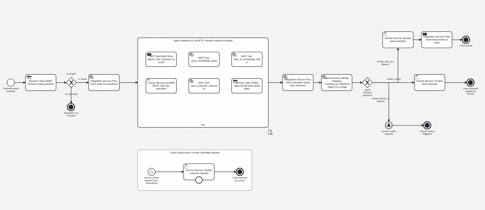

# AI Email Support Agent — Camunda 8.10 POC → CP4BA 26.0.0 Migration

Design-review pack for migrating the AI Email Support Agent from a
Camunda 8.10 self-managed proof of concept to production on IBM Cloud Pak
for Business Automation (CP4BA) 26.0.0.

## Contents

| File | Description |
|------|-------------|
| [`cp4ba-migration.pdf`](./cp4ba-migration.pdf) | The design-review pack (colour, tables). |
| [`images/baw26-target-architecture.png`](./images/baw26-target-architecture.png) | BAW 26.x target design diagram — agentic rebuild. |

## Target design — agentic rebuild

The settled target design. Rather than tracing the Camunda blueprint node-for-node,
the migration adopts the agentic pattern that fits the BAW 26.0 grain: a
**watsonx.ai agent** drives the handling region and reaches its tools over **MCP**,
while **generative AI activities** reach models over the **Model Gateway**.

**Two channels, not competing options:**

- **Model Gateway — the inference channel.** How BAW reaches a model, used by
  generative AI activities; an OpenAI-compatible proxy. Here it backs the
  Agent-as-a-Judge activity and any agent-side generation.
- **MCP — the tool-calling channel.** How the agent reaches tools: the KB/memory
  operations and BAW's own human-work tools. The agent selects and calls these at
  runtime.

**The four regions:**

- **A — Domain scope guardrail** — `Decision Task (ODM)`, deterministic and
  auditable rather than delegated to a model.
- **B — Handle customer request** — `Agent (watsonx.ai via MCP)`. Inside this
  region the MCP tools are a **catalogue the agent selects at runtime**,
  deliberately *not* joined by sequence flows. The Camunda `knowledgeBaseDecision`
  flag is gone — empty retrieval and the specialist's answer both return as tool
  results; KB writes pass a `Decision Task (ODM): Approve KB write` audit gate.
- **C — Judge & route** — `GenAI Activity (Model Gateway → watsonx.ai / Bedrock):
  Agent as a Judge`, feeding a deterministic gateway on the structured verdict
  (`solved_with_confidence` / `needs_review` / `needs_human_resolution`).
- **D — Human controlled request** — event subprocess with plain BAW human
  services; no Case Builder, since every human step here is bounded with a known
  successor.

**The discipline:** the agent's context is working memory; BAW is the system of
record. Anything that must survive is written to BAW case state *through a tool
call*, so it exists in both the transcript and the case. The transcript is where
the agent reasons; the case is where the truth lives.

## What's inside

The document covers five interlocking deliverables:

0. **The confirmed provider seam** — how the OpenAI-compatible stub
   (`stub_llm_server.py`) maps to the production Model Gateway seam.
1. **Per-node POC → CP4BA prod tally** — every BPMN element mapped to its
   CP4BA production equivalent, with AI-capability touchpoints.
2. **CP4BA target architecture** — the production topology by layer, plus the
   target diagram and the agentic-rebuild design decision.
3. **Migration runbook** — phased steps (A–E) from base BAW through the
   AI layer to cutover.
4. **AI-capability touchpoint map** — where Model Gateway, watsonx.ai LWE,
   and MCP servers attach to the flow.
5. **Component-by-component tally** — the full artifact inventory.

Plus a closing list of open items to resolve before design review.

## The three CP4BA AI capabilities

- **IBM Model Gateway** — unified OpenAI-compatible endpoint that routes to
  LLM providers; replaces the direct stub call.
- **watsonx.ai Lightweight Engine (LWE)** — in-cluster, GPU-backed model
  serving for generation and embeddings.
- **MCP servers** — expose BAW workflows, ODM decisions, and content
  operations to AI agents as discoverable tools.

## Status & caveats

This is a **design-review draft**. Statements not directly verified against a
running system are reasonable reads of IBM's CP4BA 26.0.0 documentation, not
enumerated facts, and should be confirmed against the relevant interim-fix
level. The highest-risk open item is that the **Agent-as-a-Judge** step was
never simulated by the POC stub and remains unproven against a real model.

## Related

- POC repository: [`ai-email-support-agent`](https://github.com/anupamdasgithub/ai-email-support-agent)

## License

See [`LICENSE`](./LICENSE). Documentation authored by the repository owner.
IBM, Cloud Pak, CP4BA, watsonx.ai, and Camunda are trademarks of their
respective owners; referenced here descriptively.
